# Spring Framenwork

## 1.Spring简介

### 1.1特性

1. 非侵入式：使用 Spring Framework 开发应用程序时，Spring 对应用程序本身的结构影响非常小。对领域模型可以做到零污染；对功能性组件也只需要使用几个简单的注解进行标记，完全不会破坏原有结构，反而能将组件结构进一步简化。这就使得基于 Spring Framework 开发应用程序时结构清晰、简洁优雅。
2. **控制反转**：IOC——Inversion of Control，翻转资源获取方向。把自己创建资源、向环境索取资源变成环境将资源准备好，我们享受资源注入。（重点）
3. **面向切面编程**：AOP——Aspect Oriented Programming，在不修改源代码的基础上增强代码功能。（重点）
4. 容器：Spring IOC 是一个容器，因为它包含并且管理组件对象的生命周期。组件享受到了容器化的管理，替程序员屏蔽了组件创建过程中的大量细节，极大的降低了使用门槛，大幅度提高了开发效率。（理解）
5. 组件化：Spring 实现了使用简单的组件配置组合成一个复杂的应用。在 Spring 中可以使用 XML和 Java 注解组合这些对象。这使得我们可以基于一个个功能明确、边界清晰的组件有条不紊的搭建超大型复杂应用系统。
6. 声明式：很多以前需要编写代码才能实现的功能，现在只需要声明需求即可由框架代为实现。
7. 一站式：在 IOC 和 AOP 的基础上可以整合各种企业应用的开源框架和优秀的第三方类库。而且 Spring 旗下的项目已经覆盖了广泛领域，很多方面的功能性需求可以在 Spring Framework 的基础上全部使用 Spring 来实现。

### 1.2五大功能模块

| 功能模块                | 功能介绍                                              |
| ----------------------- | :---------------------------------------------------- |
| Core Container          | 核心容器，在Spring环境下使用任何功能都必须基于IOC容器 |
| AOP&Aspects             | 面向切面编程                                          |
| Tseting                 | 提供了对Junit或TestNG测试框架的整合                   |
| Data Access/Integration | 提供了对数据访问/集成的功能                           |
| Spring MVC              | 提供了面向Web应用程序的集成功能                       |

​									

## 2.IOC

### 2.1*IOC*容器思想

IOC：Inversion of Control，翻译过来是反转控制。

1. 获取资源的传统方式：在应用程序中的组件需要获取资源时，传统的方式是组件主动的从容器中获取所需要的资源，在这样的模式下开发人员往往需要知道在具体容器中特定资源的获取方式。
2. 反转控制方式获取资源：反转了资源的获取方向——改由容器主动的将资源推送给需要的组件，开发人员不需要知道容器是如何创建资源对象的，只需要提供接收资源的方式即可。
3. DI：Dependency Injection，翻译过来是依赖注入。DI 是 IOC 的另一种表述方式：即组件以一些预先定义好的方式（例如：setter 方法）接受来自于容器的资源注入。

IOC 就是一种反转控制的思想， 而 DI 是对 IOC 的一种具体实现。

### 2.2*IOC*在Spring中的实现

​		Spring 的 IOC 容器就是 IOC 思想的一个落地的产品实现。IOC 容器中管理的组件也叫做 bean。在创建bean 之前，首先需要创建 IOC 容器。

Spring 提供了 IOC 容器的两种实现方式：

1. BeanFactory
	这是 IOC 容器的基本实现，是 Spring 内部使用的接口。面向 Spring 本身，不提供给开发人员使用。
2. ApplicationContext
3. BeanFactory 的子接口，提供了更多高级特性。面向 Spring 的使用者，几乎所有场合都使用ApplicationContext 而不是底层的 BeanFactory。

## 3.IOC-基于XML文件管理Bean

### 3.1获取bean

1. 通过bean的id获取

2. 根据类型获取

3. 根据id和类型

4. 在IOC容器中通过工厂模式和反射技术创建对象，所以***需要对象的无参构造器***

5. 当根据类型获取 bean 时，要求 IOC 容器中指定类型的 bean 有且只能有一个

6. 如果组件类实现了接口，根据接口类型可以获取 bean 吗？

	```
	可以，前提是 bean 唯一
	```

7. 如果一个接口有多个实现类，这些实现类都配置了 bean ，根据接口类型可以获取 bean 吗？

	```
	不行，因为 bean 不唯一
	```

### 3.2依赖注入

#### 3.2.1注入类型

setter注入和构造器注入，分别是调用类的set方法和有参构造

#### 3.2.2生命周期

1. 实例化，调用无参构造
2. 实例注入，调用set方法
3. 初始化之前的操作（由后置处理器负责）
4. 初始化，需要通过bean的init-method属性指定初始化方法
5. 初始化之后的操作（由后置处理器负责）
6. IOC容器关闭时销毁

#### 3.2.3工厂bean

**概念**

​		FactoryBean是Spring提供的一种整合第三方框架的常用机制。
​		和普通的bean不同，配置一个FactoryBean类型的bean，在获取bean的时候得到的并不是class属性中配置的这个类的对象，而是getObject()方法的返回值。
​		通过这种机制，Spring可以帮我们把复杂组件创建的详细过程和繁琐细节都屏蔽起来，只把最简洁的使用界面展示给我们。
​		将来我们整合Mybatis时，Spring就是通过FactoryBean机制来帮我们创建SqlSessionFactory对象的。

```
一句话：IOC容器会创建工厂bean getObject方法返回的实例类型，不会去创建工厂bean的实例。这样我们直接从ioc容器中获取工厂创建的实例对象
```

**实现FactoryBean接口**

接口中的三个方法：

1. getObject():返回一个对象给IOC容器
2. getObjectType():设置所提供对象的类型
3. isSingleton():所提供的对象是否为单例

当把FactoryBean的实现类配置为bean时，会将当前类中的getObject方法返回的对象交给IOC容器管理

#### 3.2.4自动装配

**概念**

根据指定的策略，在IOC容器中匹配某个bean，自动为为bean中的类类型的属性或者接口类型的属性赋值

**实现**

可以通过bean标签的autowire属性设置自动装配的策略

自动装配的策略：

1. no,default：表示不装配，即bean中的属性不会自动匹配某个bean为某个属性赋值

2. byType：根据赋值的属性的类型，在IOC容器中匹配某个bean为属性赋值

	异常情况：

	IOC中一个类型都匹配不上：属性就不会装配，使用默认值

	有多个类型的bean，此时会抛出异常

	总结：当使用ByType实现自动装配时，IOC容器中有且仅有一个类型匹配的bean能够为属性赋值

3. byName：将要赋值的属性的属性名作为bean的id在IOC容器中匹配某个bean，为属性赋值

4. 总结：一般使用byType。特殊情况下：当类型匹配的bean有多个时，此时可以使用byName实现自动装配

#### 3.2.5总结


## 4.IOC-基于注解管理Bean

### 4.1使用注解注册bean组件

1. @Component：将类标识为普通组件
2. @Controller：将类标识为控制层组件
3. @Service：将类标识为业务层组件
4. @Repository：将类标识为持久层组件

- 在service层和dao层，注解应该标识在接口的实现类上
- 加了注解的类在IOC容器中的**默认id为类名的小驼峰**

### 4.2@Autowired自动装配

**能够标识的位置**

1. 成员变量上，此时不需要设置成员变量的set方法
2. set方法上
3. 为当前成员变量赋值的有参构造器上

**注入方式**

@Autowired默认通过byType方式自动注入，在IOC容器中通过类型匹配某个bean为属性赋值

若有多个类型匹配的bean，此时会自动转化为byName的方式来实现自动装配的效果

即将要赋值的属性的属性名作为bean的id匹配某个bean为属性赋值

若byType和byName的方式都无法实现自动装配，即IOC容器中有多个类型匹配的bean，且这些bean的id和要复制的属性的属性名都不一致，此时抛异常。

此时可以在要赋值的属性上，添加一个注解@Qualifier("value")通过该注解的value属性值，指定某个bean的id，然后将这个bean为属性赋值

```
注意：若IOC容器中没有任何一个类型匹配bean，此时抛出异常：NoSuchBeanDefinitionException
在@Autowired注解中有个required属性，默认值为true，要求必须完成自动装配
可以将required设置为false，此时能装配则装配，无法装配则使用属性的默认值
```

### 4.3总结

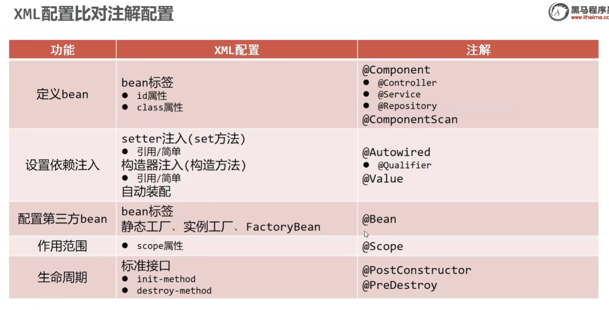

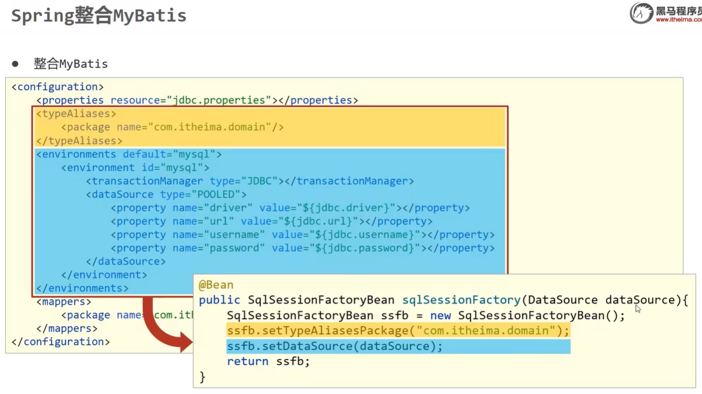

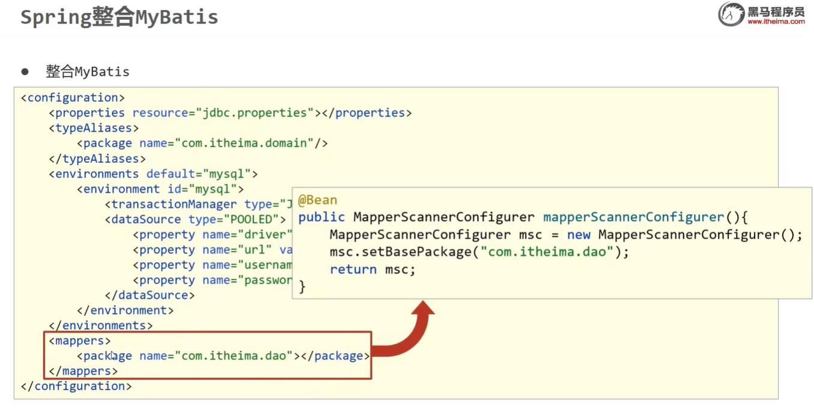

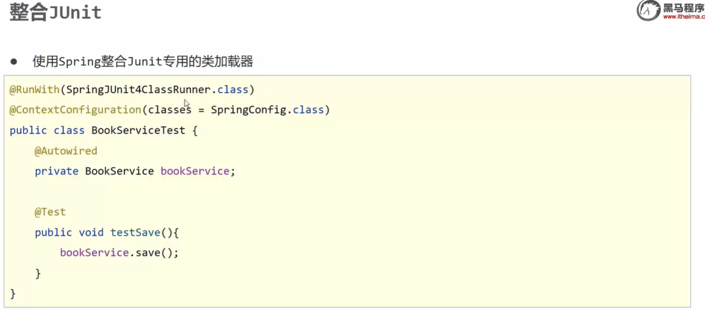

## 5.AOP-概念

### 5.1代理模式

二十三种设计模式中的一种，属于结构型模式。它的作用就是通过提供一个代理类，让我们在调用目标方法的时候，不再是直接对目标方法进行调用，而是通过代理类间接调用。

让不属于目标方法核心逻辑的代码从目标方法中剥离出来——解耦。调用目标方法时先调用代理对象的方法，减少对目标方法的调用和打扰，同时让附加功能能够集中在一起也有利于统一维护。

### 5.2AOP概念及相关术语

**AOP**

AOP（Aspect Oriented Programming）面向切面编程，是一种设计思想，是面向对象编程的一种补充和完善。它以通过预编译方式和运行期动态代理方式实现在不修改源代码的情况下给程序动态统一添加额外功能的一种技术

简单来说：就是把非核心业务抽取出来，给切面类管理。再把抽取出来的放到相应的位置。

##### 横切关注点

从目标对象中抽取出来的非核心业务，比如之前代理模式中的日志功能，针对于计算器功能来说，日志就是非核心业务。

这个概念不是语法层面天然存在的，而是根据附加功能的逻辑上的需要：有十个附加功能，就有十个横切关注点。

**通知**

非核心的业务再目标对象中叫做横切关注点，将横切关注点抽取出来封装到切面类中，他就是这个类中的一个方法叫做通知。

每一个横切关注点要做的事情都封装成一个方法，这样的方法就叫做通知方法。

1. 前置通知：在被代理的目标方法前执行
2. 返回通知：在被代理的目标方法成功结束后执行（寿终正寝）
3. 异常通知：在被代理的目标方法异常结束后执行（死于非命）
4. 后置通知：在被代理的目标方法最终结束后执行（盖棺定论）
5. 环绕通知：使用try…catch…finally结构围绕整个被代理的目标方法，包括上面四种通知对应的所有位置

##### 切面

封装横切关注点的类，通知的方法都写在切面类中

##### 目标

被代理的目标对象，比如计算器的实现类

##### 代理

代理对象

##### 连接点

一个纯逻辑的概念：抽取横切关注点的位置，比如方法执行之前，方法捕获异常的时候等等。

连接点的作用：我们不但要抽取出来，还要套回去。

##### 总结

抽和套，抽取出来横切关注点，封装到切面中，就是一个通知。然后通过切入点找到连接点，把通知套到连接点的位置。

### 5.3总结

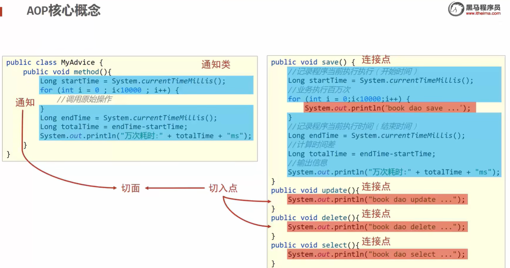

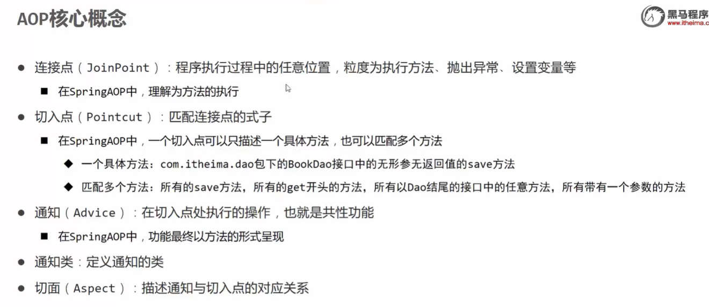

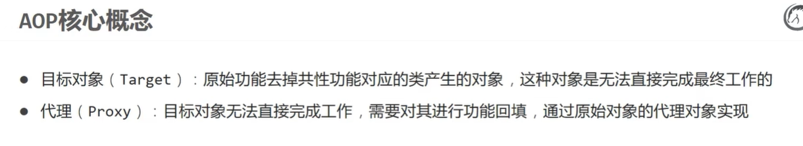

## 6.AOP-基于注解的AOP

### 6.1技术说明

1. 动态代理（InvocationHandler）：JDK原生的实现方式，需要被代理的目标类必须实现接口。因为这个技术要求代理对象和目标对象实现同样的接口（兄弟两个拜把子模式）。
2. cglib：通过继承被代理的目标类（认干爹模式）实现代理，所以不需要目标类实现接口。
3. AspectJ：本质上是静态代理，将代理逻辑“织入”被代理的目标类编译得到的字节码文件，所以最终效果是动态的。weaver就是织入器。Spring只是借用了AspectJ中的注解。

### 6.2切面类

1. 在切面中，需要通过指定的注解将方法标识为通知方法

	- @Before：前置通知，在目标方法执行之前执行
	- @After：后置通知，在目标对象方法的finally子句中执行
	- @AfterReturning：返回通知，在目标对象方法返回值之后执行
	- @AfterThrowing：异常通知，在目标对象方法的catch子句中执行
	- @Around：环绕通知

2. 切入点表达式：设置在表示通知的注解的value属性中

	```
	* "execution(public int com.zylai.spring.aop.annotation.CalculatorImpl.add(int,int))"
	* "execution(* com.zylai.spring.aop.annotation.*.*(..))"
	* 第一个*表示任意的访问修饰符和返回值类型
	* 第二个*表示包下所有的类
	* 第三个*表示类中任意的方法
	* ..表示任意的参数列表
	```

3. 重用连接点表达式

	```
	* //声明一个公共的切入点表达式
	* @Pointcut("execution(* com.zylai.spring.aop.annotation.CalculatorImpl.*(..))")
	* public void pointCut(){}
	* 使用方式：  @After("pointCut()")
	```

4. 获取连接点信息

	```
	* 在通知方法的参数位置，设置JoinPoint类型的参数，就可以获取连接点所对应的方法信息
	*  //获取连接点对应方法的签名信息
	*  Signature signature = joinPoint.getSignature();
	*  //获取连接点所对应的参数
	*  Object[] args = joinPoint.getArgs();
	```

5. 切面的优先级

	```
	*  可以通过@Order注解的value属性设置优先级，默认值为Integer.MAX
	*  value值越小优先级越高
	```

**总的**

```java
* 1. 在切面中，需要通过指定的注解将方法标识为通知方法
*
* 2. 切入点表达式：设置在表示通知的注解的value属性中
* "execution(public int com.zylai.spring.aop.annotation.CalculatorImpl.add(int,int))"
* "execution(* com.zylai.spring.aop.annotation.*.*(..))"
* 第一个*表示任意的访问修饰符和返回值类型
* 第二个*表示包下所有的类
* 第三个*表示类中任意的方法
* ..表示任意的参数列表
*
* 3.重用连接点表达式
* //声明一个公共的切入点表达式
* @Pointcut("execution(* com.zylai.spring.aop.annotation.CalculatorImpl.*(..))")
* public void pointCut(){}
* 使用方式：  @After("pointCut()")
*
* 4. 获取连接点信息
* 在通知方法的参数位置，设置JoinPoint类型的参数，就可以获取连接点所对应的方法信息
*  //获取连接点对应方法的签名信息
*  Signature signature = joinPoint.getSignature();
*  //获取连接点所对应的参数
*  Object[] args = joinPoint.getArgs();
*
*  5.切面的优先级
*  可以通过@Order注解的value属性设置优先级，默认值为Integer.MAX
*  value值越小优先级越高

@Component
@Aspect//将当前组件表示为切面
public class LoggerAspect {

    @Pointcut("execution(* com.zylai.spring.aop.annotation.CalculatorImpl.*(..))")
    public void pointCut(){}


//    @Before("execution(public int com.zylai.spring.aop.annotation.CalculatorImpl.add(int,int))")
    //表示这个类下所有的方法，用*表示所有，参数列表用..表示所有的参数列表
//    @Before("execution(* com.zylai.spring.aop.annotation.CalculatorImpl.*(..))")
    @Before("pointCut()")
    public void beforeAdviceMethod(JoinPoint joinPoint){
        //获取连接点对应方法的签名信息（签名信息就是方法的声明信息）
        Signature signature = joinPoint.getSignature();
        //获取连接点所对应的参数
        Object[] args = joinPoint.getArgs();
        System.out.println("LoggerAspect，前置通知，方法："+signature.getName()+",参数："+ Arrays.toString(args));
    }

    @After("pointCut()")
    public void afterAdviceMethod(JoinPoint joinPoint){
        //获取连接点对应方法的签名信息（签名信息就是方法的声明信息）
        Signature signature = joinPoint.getSignature();
        System.out.println("LoggerAspect，后置通知，方法："+signature.getName()+"，执行完毕");
    }

    //在返回通知中若要获取目标对象方法的返回值，只需要通过注解的returning属性值
    //就可以将通知方法的某个参数指定为接收目标对象方法的返回值
    @AfterReturning(value = "pointCut()",returning = "result")
    public void afterReturningAdviceMethod(JoinPoint joinPoint, Object result){
        Signature signature = joinPoint.getSignature();
        System.out.println("LoggerAspect，返回通知，方法："+signature.getName()+"，结果："+result);
    }

    //在返回通知中若要获取目标对象方法的异常，只需要通过注解的throwing属性值
    //就可以将通知方法的某个参数指定为接收目标对象方法出现的异常
    @AfterThrowing(value = "pointCut()",throwing = "ex")
    public void afterThrowingAdviceMethod(JoinPoint joinPoint,Throwable ex){
        Signature signature = joinPoint.getSignature();
        System.out.println("LoggerAspect，异常通知，方法："+signature.getName()
        +"异常："+ex);
    }


    @Around("pointCut()")
    //环绕通知的方法返回值一定要和目标方法的返回值一致
    public Object aroundAdviceMethod(ProceedingJoinPoint joinPoint){
        Object result = null;
        try {
            System.out.println("环绕通知-->前置通知");
            //表示目标对象方法的执行
            result = joinPoint.proceed();
            System.out.println("环绕通知-->返回通知");
        } catch (Throwable throwable) {
            throwable.printStackTrace();
            System.out.println("环绕通知-->异常通知");
        }finally {
            System.out.println("环绕通知-->后置通知");
        }
        return result;
    }
}
```

### 6.3其他

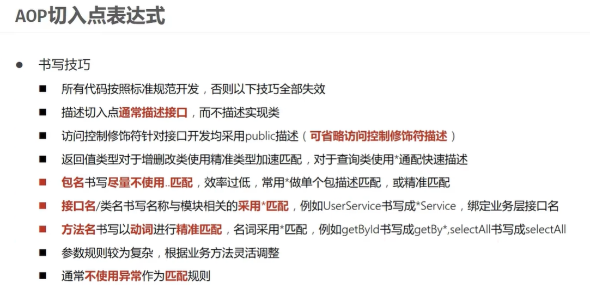

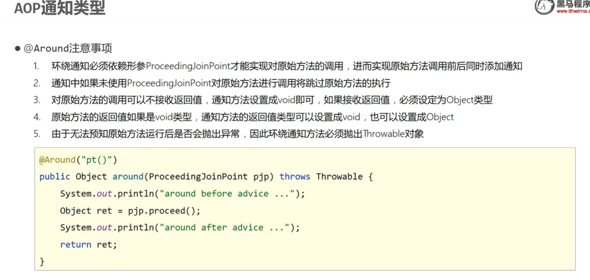

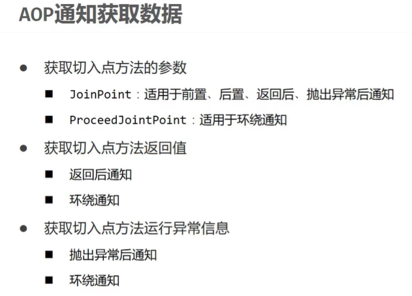

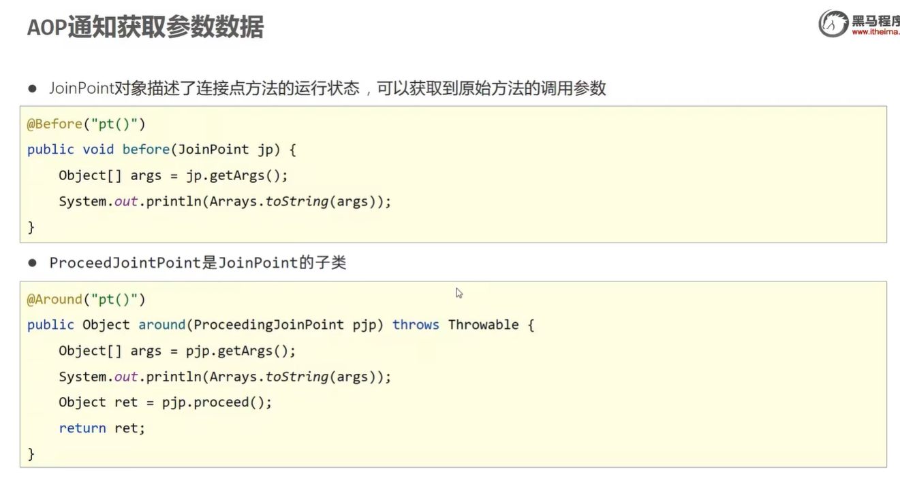

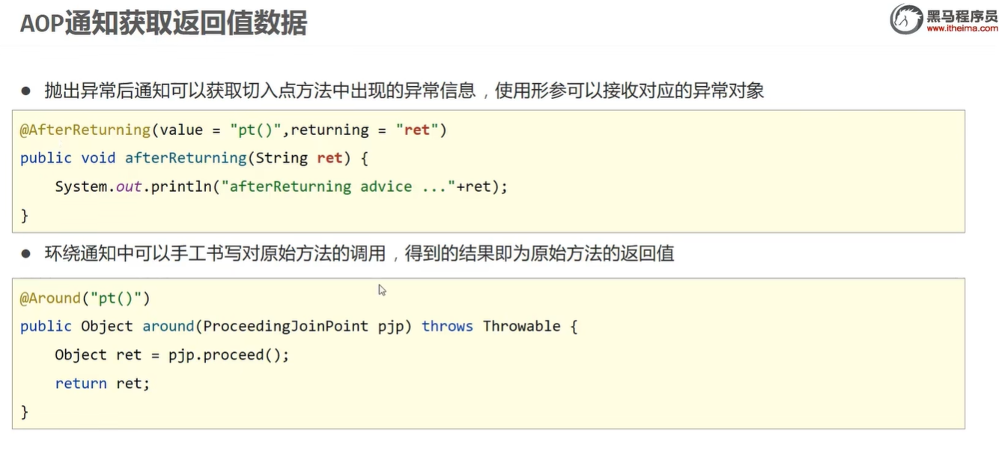

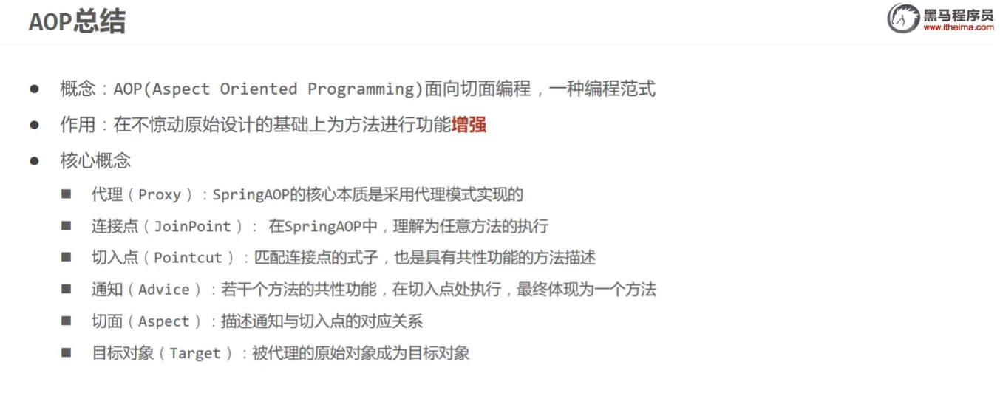

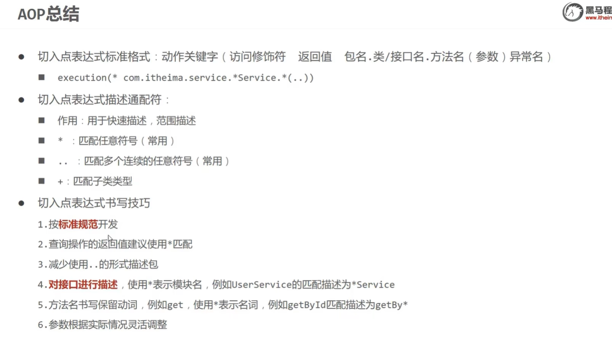

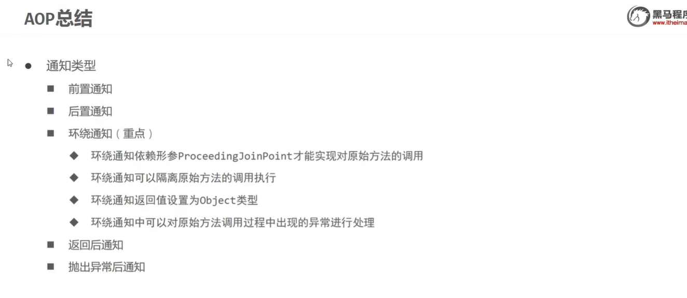

## 7.声明式事务

### 7.1事物的属性

**只读**

1. 介绍
	对一个查询操作来说，如果我们把它设置成只读，就能够明确告诉数据库，这个操作不涉及写操作。这样数据库就能够针对查询操作来进行优化

2. 使用方式

	```
	@Transactional(readOnly = true)
	 public void buyBook(Integer userId, Integer bookId) {
	        //查询图书的价格
	        Integer price = bookDao.getPriceByBookId(bookId);
	
	        //更新图书的库存
	        bookDao.updateStock(bookId);
	        //更新用户的余额
	        bookDao.updateBalance(userId,price);
	    }
	```

3. 注意
	对增删改操作设置只读会抛出下面异常：
	Caused by: java.sql.SQLException: Connection is read-only. Queries leading to data modification are not allowed

**超时**

1. 介绍

	事务在执行过程中，有可能因为遇到某些问题，导致程序卡住，从而长时间占用数据库资源。而长时间占用资源，大概率是因为程序运行出现了问题（可能是Java程序或MySQL数据库或网络连接等等）。
	此时这个很可能出问题的程序应该被回滚，撤销它已做的操作，事务结束，把资源让出来，让其他正常程序可以执行。

	概括来说就是一句话：超时回滚，释放资源。

2. 使用方式

	```
	@Transactional(timeout = 3)
	public void buyBook(Integer bookId, Integer userId) {
	    try {
	    TimeUnit.SECONDS.sleep(5);
	    } catch (InterruptedException e) {
	    e.printStackTrace();
	    }
	    //查询图书的价格
	    Integer price = bookDao.getPriceByBookId(bookId);
	    //更新图书的库存
	    bookDao.updateStock(bookId);
	    //更新用户的余额
	    bookDao.updateBalance(userId, price);
	    //System.out.println(1/0);
	}
	```

3. 观察结果

	执行过程中抛出异常：
	org.springframework.transaction.TransactionTimedOutException: Transaction timed out:
	deadline was Fri Jun 04 16:25:39 CST 2022

**回滚策略**

声明式事务默认对于运行时异常都进行回滚，一般使用的是在此基础上加上不因为哪个异常而回滚

可以通过@Transactional中相关属性设置回滚策略
rollbackFor属性：需要设置一个Class类型的对象
rollbackForClassName属性：需要设置一个字符串类型的全类名
noRollbackFor属性：需要设置一个Class类型的对象
rollbackFor属性：需要设置一个字符串类型的全类名

```
@Transactional(noRollbackFor = ArithmeticException.class)
//@Transactional(noRollbackForClassName = "java.lang.ArithmeticException")
public void buyBook(Integer bookId, Integer userId) {
    //查询图书的价格
    Integer price = bookDao.getPriceByBookId(bookId);
    //更新图书的库存
    bookDao.updateStock(bookId);
    //更新用户的余额
    bookDao.updateBalance(userId, price);
    System.out.println(1/0);
}
```

**隔离级别**

数据库系统必须具有隔离并发运行各个事务的能力，使它们不会相互影响，避免各种并发问题。一个事务与其他事务隔离的程度称为隔离级别。SQL标准中规定了多种事务隔离级别，不同隔离级别对应不同的干扰程度，隔离级别越高，数据一致性就越好，但并发性越弱。

隔离级别一共有四种：

- 读未提交：READ UNCOMMITTED
	允许Transaction01读取Transaction02未提交的修改。
- 读已提交：READ COMMITTED、
	要求Transaction01只能读取Transaction02已提交的修改。

- 可重复读：REPEATABLE READ
	确保Transaction01可以多次从一个字段中读取到相同的值，即Transaction01执行期间禁止其它事务对这个字段进行更新。

- 串行化：SERIALIZABLE
	确保Transaction01可以多次从一个表中读取到相同的行，在Transaction01执行期间，禁止其它事务对这个表进行添加、更新、删除操作。可以避免任何并发问题，但性能十分低下。

使用

```
@Transactional(isolation = Isolation.DEFAULT)//使用数据库默认的隔离级别
@Transactional(isolation = Isolation.READ_UNCOMMITTED)//读未提交
@Transactional(isolation = Isolation.READ_COMMITTED)//读已提交
@Transactional(isolation = Isolation.REPEATABLE_READ)//可重复读
@Transactional(isolation = Isolation.SERIALIZABLE)//串行化
```

**事务传播**

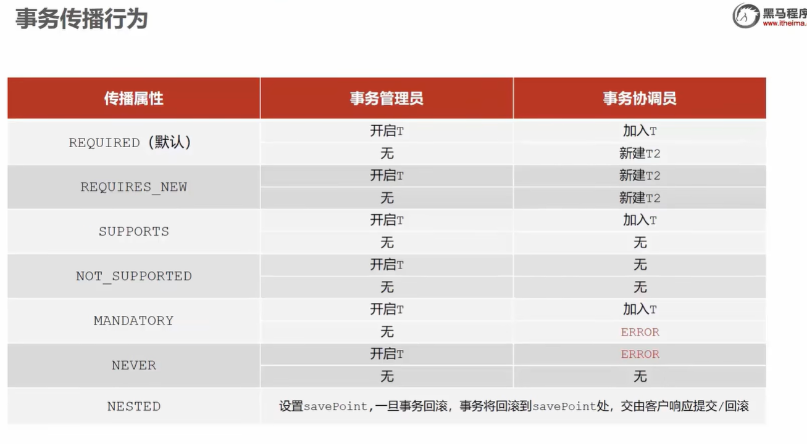

### 7.2总结

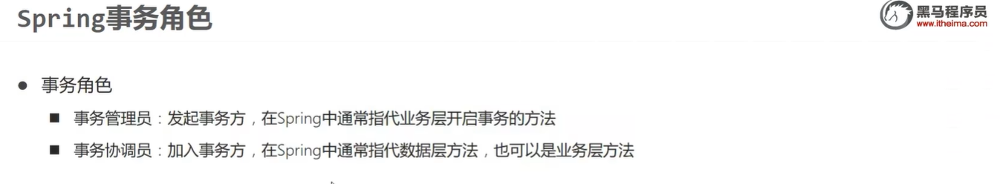

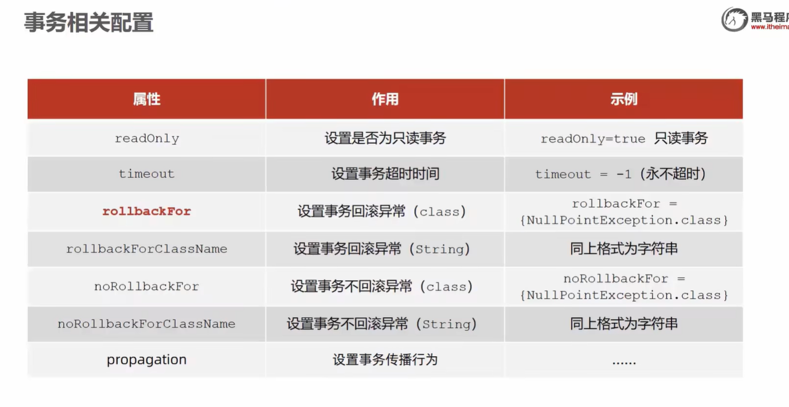
