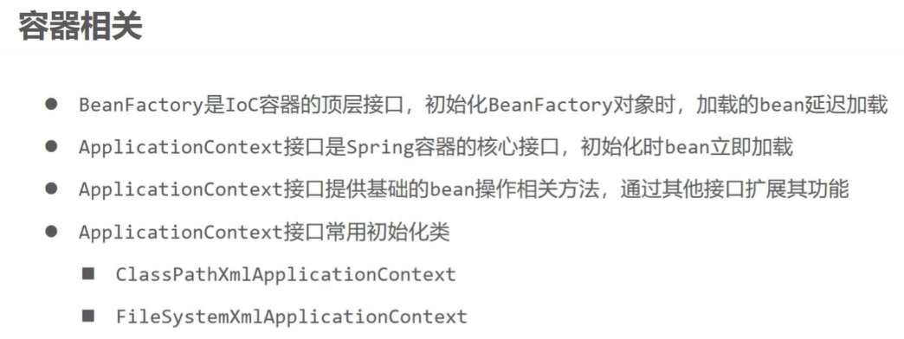
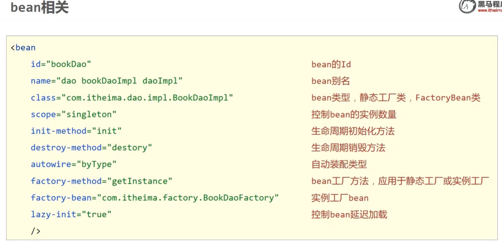
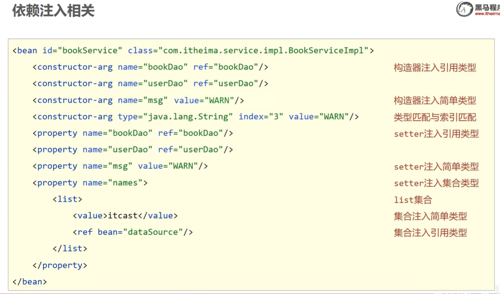

# Spring Framenwork

## 1.Spring简介

### 1.1特性

1. 非侵入式：使用 Spring Framework 开发应用程序时，Spring 对应用程序本身的结构影响非常小。对领域模型可以做到零污染；对功能性组件也只需要使用几个简单的注解进行标记，完全不会破坏原有结构，反而能将组件结构进一步简化。这就使得基于 Spring Framework 开发应用程序时结构清晰、简洁优雅。
2. **控制反转**：IOC——Inversion of Control，翻转资源获取方向。把自己创建资源、向环境索取资源变成环境将资源准备好，我们享受资源注入。（重点）
3. **面向切面编程**：AOP——Aspect Oriented Programming，在不修改源代码的基础上增强代码功能。（重点）
4. 容器：Spring IOC 是一个容器，因为它包含并且管理组件对象的生命周期。组件享受到了容器化的管理，替程序员屏蔽了组件创建过程中的大量细节，极大的降低了使用门槛，大幅度提高了开发效率。（理解）
5. 组件化：Spring 实现了使用简单的组件配置组合成一个复杂的应用。在 Spring 中可以使用 XML和 Java 注解组合这些对象。这使得我们可以基于一个个功能明确、边界清晰的组件有条不紊的搭建超大型复杂应用系统。
6. 声明式：很多以前需要编写代码才能实现的功能，现在只需要声明需求即可由框架代为实现。
7. 一站式：在 IOC 和 AOP 的基础上可以整合各种企业应用的开源框架和优秀的第三方类库。而且 Spring 旗下的项目已经覆盖了广泛领域，很多方面的功能性需求可以在 Spring Framework 的基础上全部使用 Spring 来实现。

### 1.2五大功能模块

| 功能模块                | 功能介绍                                              |
| ----------------------- | :---------------------------------------------------- |
| Core Container          | 核心容器，在Spring环境下使用任何功能都必须基于IOC容器 |
| AOP&Aspects             | 面向切面编程                                          |
| Tseting                 | 提供了对Junit或TestNG测试框架的整合                   |
| Data Access/Integration | 提供了对数据访问/集成的功能                           |
| Spring MVC              | 提供了面向Web应用程序的集成功能                       |

​									

## 2.IOC

### 2.1*IOC*容器思想

IOC：Inversion of Control，翻译过来是反转控制。

1. 获取资源的传统方式：在应用程序中的组件需要获取资源时，传统的方式是组件主动的从容器中获取所需要的资源，在这样的模式下开发人员往往需要知道在具体容器中特定资源的获取方式。
2. 反转控制方式获取资源：反转了资源的获取方向——改由容器主动的将资源推送给需要的组件，开发人员不需要知道容器是如何创建资源对象的，只需要提供接收资源的方式即可。
3. DI：Dependency Injection，翻译过来是依赖注入。DI 是 IOC 的另一种表述方式：即组件以一些预先定义好的方式（例如：setter 方法）接受来自于容器的资源注入。

IOC 就是一种反转控制的思想， 而 DI 是对 IOC 的一种具体实现。

### 2.2*IOC*在Spring中的实现

​		Spring 的 IOC 容器就是 IOC 思想的一个落地的产品实现。IOC 容器中管理的组件也叫做 bean。在创建bean 之前，首先需要创建 IOC 容器。

Spring 提供了 IOC 容器的两种实现方式：

1. BeanFactory
	这是 IOC 容器的基本实现，是 Spring 内部使用的接口。面向 Spring 本身，不提供给开发人员使用。
2. ApplicationContext
3. BeanFactory 的子接口，提供了更多高级特性。面向 Spring 的使用者，几乎所有场合都使用ApplicationContext 而不是底层的 BeanFactory。

## 3.IOC-基于XML文件管理Bean

### 3.1获取bean

1. 通过bean的id获取

2. 根据类型获取

3. 根据id和类型

4. 在IOC容器中通过工厂模式和反射技术创建对象，所以***需要对象的无参构造器***

5. 当根据类型获取 bean 时，要求 IOC 容器中指定类型的 bean 有且只能有一个

6. 如果组件类实现了接口，根据接口类型可以获取 bean 吗？

	```
	可以，前提是 bean 唯一
	```

7. 如果一个接口有多个实现类，这些实现类都配置了 bean ，根据接口类型可以获取 bean 吗？

	```
	不行，因为 bean 不唯一
	```

### 3.2依赖注入

#### 3.2.1注入类型

setter注入和构造器注入，分别是调用类的set方法和有参构造

#### 3.2.2生命周期

1. 实例化，调用无参构造
2. 实例注入，调用set方法
3. 初始化之前的操作（由后置处理器负责）
4. 初始化，需要通过bean的init-method属性指定初始化方法
5. 初始化之后的操作（由后置处理器负责）
6. IOC容器关闭时销毁

#### 3.2.3工厂bean

**概念**

​		FactoryBean是Spring提供的一种整合第三方框架的常用机制。
​		和普通的bean不同，配置一个FactoryBean类型的bean，在获取bean的时候得到的并不是class属性中配置的这个类的对象，而是getObject()方法的返回值。
​		通过这种机制，Spring可以帮我们把复杂组件创建的详细过程和繁琐细节都屏蔽起来，只把最简洁的使用界面展示给我们。
​		将来我们整合Mybatis时，Spring就是通过FactoryBean机制来帮我们创建SqlSessionFactory对象的。

```
一句话：IOC容器会创建工厂bean getObject方法返回的实例类型，不会去创建工厂bean的实例。这样我们直接从ioc容器中获取工厂创建的实例对象
```

**实现FactoryBean接口**

接口中的三个方法：

1. getObject():返回一个对象给IOC容器
2. getObjectType():设置所提供对象的类型
3. isSingleton():所提供的对象是否为单例

当把FactoryBean的实现类配置为bean时，会将当前类中的getObject方法返回的对象交给IOC容器管理

#### 3.2.4自动装配

**概念**

根据指定的策略，在IOC容器中匹配某个bean，自动为为bean中的类类型的属性或者接口类型的属性赋值

**实现**

可以通过bean标签的autowire属性设置自动装配的策略

自动装配的策略：

1. no,default：表示不装配，即bean中的属性不会自动匹配某个bean为某个属性赋值

2. byType：根据赋值的属性的类型，在IOC容器中匹配某个bean为属性赋值

	异常情况：

	IOC中一个类型都匹配不上：属性就不会装配，使用默认值

	有多个类型的bean，此时会抛出异常

	总结：当使用ByType实现自动装配时，IOC容器中有且仅有一个类型匹配的bean能够为属性赋值

3. byName：将要赋值的属性的属性名作为bean的id在IOC容器中匹配某个bean，为属性赋值

4. 总结：一般使用byType。特殊情况下：当类型匹配的bean有多个时，此时可以使用byName实现自动装配

#### 3.2.5总结








## 4.IOC-基于注解管理Bean

## 5.AOP-概念

## 6.AOP-基于注解的AOP

## 7.声明式事务

